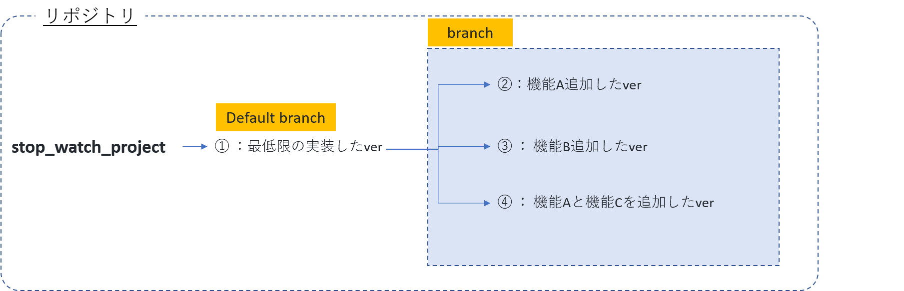

# stop_watch_project

### 1.C#を初めて開発します。
自ら手を動かしてC#をプログラミングするのは初めての案件です。 

### 2.GitHubを（ほぼ）初めて使用します。
試行錯誤して身体で身に着けるためのテストプロジェクトです。 
ちなみに仕事では当面使う予定はなさそうです。

### 3.実務で覚える機会がまだないので、自分の中で案件化します。
最低限の機能を実装して完成したら、仕様変更し、バージョンアップしていきます。 
バージョンアップするごとにブランチ（分岐）させます。

### 4.以下のドキュメントを用意します。
1.提案書 
2.要件定義書 
3.基本設計書 
4.詳細設計書 
5.プログラム設計書 

### 5.今後の予定

